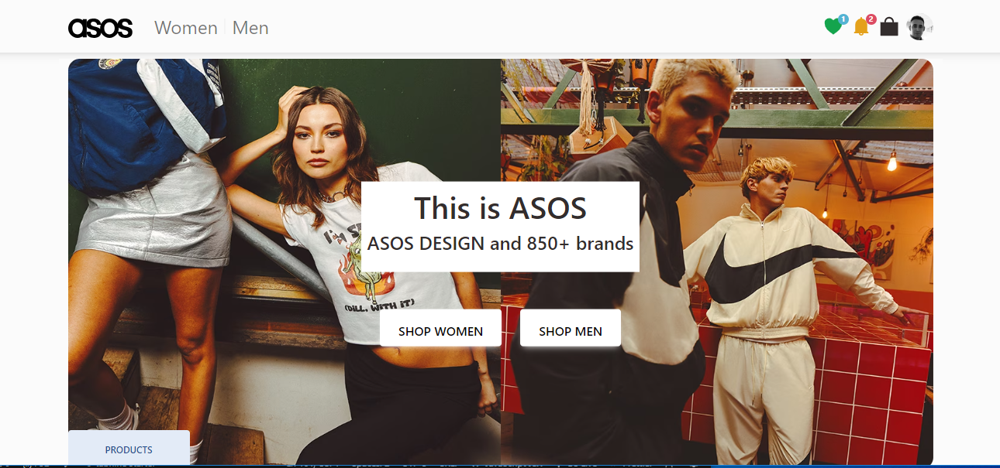

# React + Vite + Redux

## REDUX PROJECT -asos.com

# ASOS Alışveriş Deneyimi Projesi

Bu proje, React Vite ve Redux teknolojilerini kullanarak gerçek zamanlı bir alışveriş deneyimi sunmak amacıyla geliştirilmiştir. ASOS.com alışveriş sitesinden ilham alarak hazırlanan bu proje, kullanıcıların dinamik ürün kartları oluşturmasına, favori ürünleri işaretleme ve sepete ekleme gibi kişiselleştirilmiş deneyimler yaşamasına olanak tanır.

## Projenin Öne Çıkan Özellikleri

- 🛒 **Dinamik Ürün Kartları:** Ürün kartları, RapidAPI üzerinden çekilen verilerle anlık olarak oluşturulur ve güncellenir.
- ❤️ **Favorilere Ekle & Sepete Ekle:** Ürünleri favorilere eklemek ve sepete eklemek artık tek tıklama kadar basit.
- 🛍️ **Sepet ve Favori Sayfaları:** Ayrı sayfalarda favori ürünlerinizi ve sepetinizdeki ürünleri görüntüleyebilir, işlemlerinizi kolayca yönetebilirsiniz.
- 📈 **Dinamik Toplam Hesaplama:** Sepet sayfasında anlık olarak toplam tutarı gösteren dinamik hesaplama ile bütçenizi kontrol edebilirsiniz.

## Projeyi Deneyimle

Projeyi yerel makinenizde çalıştırmak için aşağıdaki adımları izleyebilirsiniz:

1. Repository'yi klonlayın: `git clone https://github.com/yourusername/asos-shopping-project.git`
2. Proje klasörüne gidin: `cd asosShop-Redux`
3. Gerekli bağımlılıkları yüklemek için: `npm install` veya `yarn install`
4. Projeyi başlatmak için: `npm start` veya `yarn start`

Bu proje, React, Redux ve RapidAPI gibi teknolojilerin gücünü kullanarak geliştirilen bir alışveriş deneyimi sunar. 

# Axios
- - API url: https://asos2.p.rapidapi.com

## Preview

# asosShop-Redux
